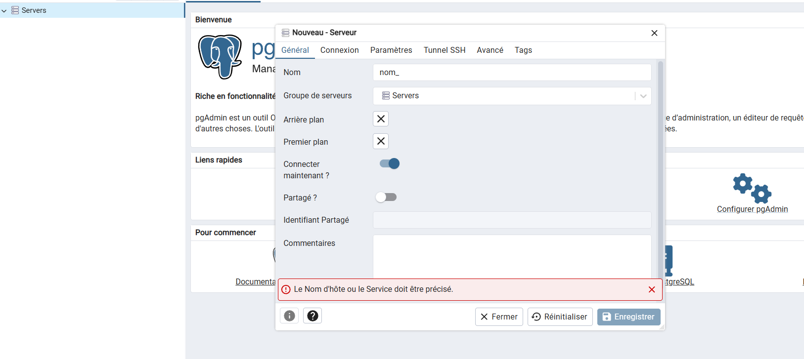
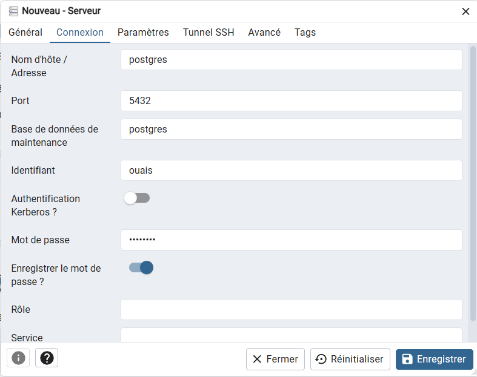

# Guide d'installation de l'environnement de developpement

## Pre-requis

- **Docker Desktop** installe et demarre
- **Git** configure

## Etape 1 : Cloner et configurer

```bash
git clone https://github.com/Tres7/afristay.git
cd afristay
cp .env.example .env
```

Editez `.env` avec vos propres valeurs :
```env
POSTGRES_DB=afristayDB
POSTGRES_USER=votre_username
POSTGRES_PASSWORD=votre_password

PGADMIN_EMAIL=votre_email@example.com
PGADMIN_PASSWORD=votre_password

DJANGO_SECRET_KEY=votre-cle-secrete
DJANGO_DEBUG=True
DJANGO_ALLOWED_HOSTS=localhost,127.0.0.1,0.0.0.0
```

## Etape 2 : Lancer les services

```bash
docker compose up --build
```

Cela va :
- Telecharger les images PostgreSQL et pgAdmin
- Construire les images backend (Django) et frontend (Next.js)
- Demarrer tous les services

## Etape 3 : Initialiser la base de donnees

```bash
docker compose exec backend python manage.py migrate
docker compose exec backend python manage.py createsuperuser
```

## Acces aux services

| Service        | URL                          |
|----------------|------------------------------|
| Frontend       | http://localhost:3000         |
| Backend API    | http://localhost:8000         |
| Admin Django   | http://localhost:8000/admin   |
| pgAdmin        | http://localhost:5051         |

## Configuration pgAdmin

1. Ouvrir http://localhost:5051
2. Se connecter avec les identifiants du `.env`
3. Ajouter un nouveau serveur :
   - **Host** : `db` (nom du service Docker)
   - **Port** : `5432` (port interne du container)
   - **Username** : valeur de `POSTGRES_USER`
   - **Password** : valeur de `POSTGRES_PASSWORD`




## Commandes utiles

```bash
# Arreter les services
docker compose down

# Voir les logs d'un service
docker compose logs -f backend

# Reinitialiser la base de donnees
docker compose down -v   # supprime le volume
docker compose up --build
docker compose exec backend python manage.py migrate
```
