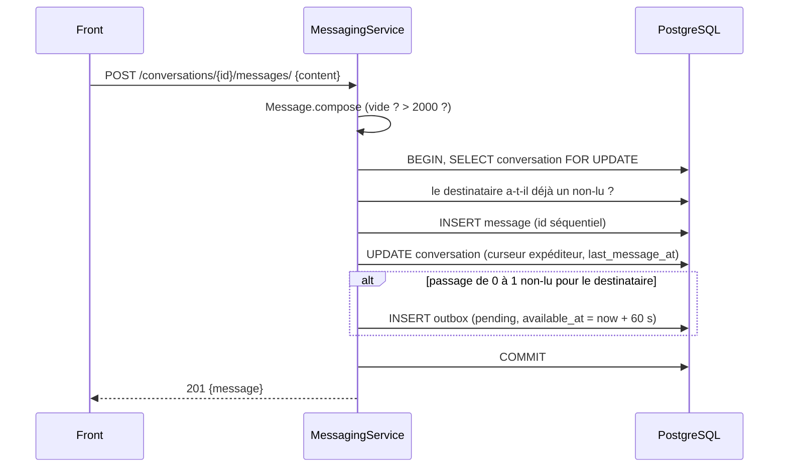
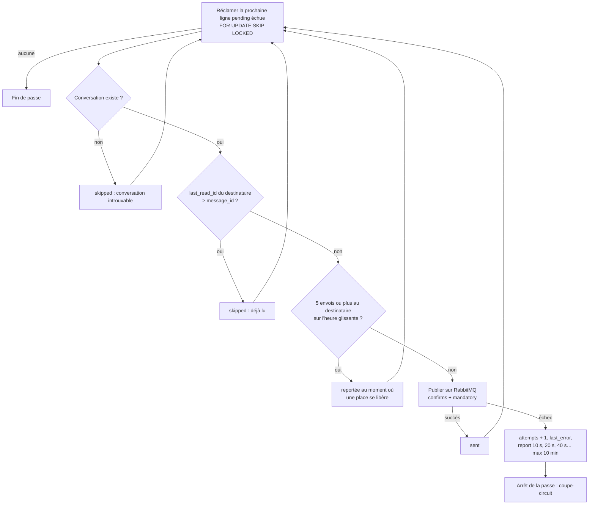

# Module messaging

Messagerie entre un voyageur et l'hôte d'un hébergement, avec notification par email du destinataire.

Décisions liées : [ADR-015](../ADR/ADR-015-reception-des-messages-par-polling-rest.md) (polling), [ADR-016](../ADR/ADR-016-outbox-et-relais-pour-les-notifications-de-la-messagerie.md) (outbox et relais), [ADR-017](../ADR/ADR-017-curseurs-de-lecture-et-regle-de-notification-0-a-1.md) (curseurs et règle 0→1), [ADR-018](../ADR/ADR-018-garde-fous-anti-abus-de-la-messagerie.md) (anti-abus), [ADR-014](../ADR/ADR-014-fiabilite-du-consumer-rabbitmq-par-dead-letter-queue.md) (dead-letter queue du consumer).

## En bref

- Un voyageur ouvre un fil depuis la fiche d'un hébergement (« Contacter l'hôte »). Il y a un seul fil par couple (hébergement, voyageur).
- Les deux participants échangent des messages. Le front récupère les nouveaux messages par polling.
- Quand un fil passe de 0 à 1 message non lu pour le destinataire, un email lui est envoyé environ une minute plus tard, sauf s'il a lu entre-temps.
- L'app Django s'appelle `messaging` (le label `messages` est déjà pris par `django.contrib.messages`). Les routes sont sous `/api/v1/messaging/`.

## Architecture

Le module suit l'architecture en couches des autres modules hexagonaux (`users`, `favoris`).

```
apps/messaging/
├── domain/
│   ├── entities/            Conversation (participants, curseurs de lecture), Message (validation, extrait)
│   ├── repositories/        ConversationRepository, MessageRepository (interfaces)
│   └── exceptions/
├── application/
│   ├── service/             MessagingService (cas d'usage), OutboxRelayService (relais)
│   ├── ports/               HebergementLookup, UserLookup, NotificationOutbox, EventPublisher, TransactionManager
│   ├── dto/
│   └── events/              NewMessageEmailRequested (contrat de l'événement)
├── infrastructure/
│   ├── persistence/         modèles ORM, repositories Django, outbox, transactions
│   ├── lookups/             seuls accès aux modèles des modules hébergements et users
│   ├── messaging/           RabbitMQEventBus (utilisé par le relais uniquement)
│   ├── http/                controllers, routes, permission IsVerified
│   └── container.py         assemblage des services avec leurs adapters
└── management/commands/relay_messaging_outbox.py
```

Le domaine ne connaît que des UUID. Il ne lit jamais directement les modèles `HebergementModel` ou `UserModel` : il passe par les ports `HebergementLookup` et `UserLookup`, dont seules les implémentations infra dépendent des autres modules.

## Modèle de données

| Table | Rôle | Points clés |
|---|---|---|
| `messaging_conversation` | Un fil | PK UUID. FK `hebergement`, `guest`, `host` (copie de l'hôte à la création). Curseurs `guest_last_read_id` et `host_last_read_id`. Unicité `(hebergement, guest)`. |
| `messaging_message` | Un message | PK **entier séquentiel** (sert de curseur). FK `conversation`, `sender`. `content` limité à 2000 caractères par le domaine. |
| `messaging_notification_outbox` | Notifications à publier | `status` (`pending` / `sent` / `skipped`), `available_at`, `attempts`, `last_error`, `skip_reason`, `payload` (événement figé). Pas de FK, pour rester lisible même si le fil est supprimé. |
| `django_cache` | Compteurs des throttles | Créée par la migration `messaging 0002`. |

**Non-lus** : pour un participant, les messages de l'autre participant dont l'id est supérieur à son curseur. Un curseur ne recule jamais, et envoyer un message fait avancer le curseur de l'expéditeur.

## Flux

### Envoi d'un message



Aucun appel à RabbitMQ dans la requête.

### Cycle du relais

Toutes les 10 s, le relais traite au plus 20 lignes, une ligne par transaction :



Une fois par heure, les lignes `sent` et `skipped` de plus de 7 jours sont supprimées.

### Lecture

Le front appelle `POST /conversations/{id}/read/` avec `up_to_id` = id du dernier message affiché :
- à l'ouverture du fil ;
- puis à chaque polling qui ramène un message de l'autre participant.

## Contrat d'API

Toutes les routes exigent un JWT (`Authorization: Bearer ...`). Préfixe : `/api/v1/messaging`.

| Méthode | Route | Corps / paramètres | Réponse |
|---|---|---|---|
| GET | `/conversations/` | — | `{results: [Conversation], count}`, fils triés par activité récente |
| POST | `/conversations/` | `{hebergement_id}` | `201` fil créé, `200` fil existant (idempotent) |
| GET | `/conversations/{id}/` | — | `Conversation` |
| GET | `/conversations/{id}/messages/` | `?after=<id>` (nouveaux messages), `?limit=` (défaut 50, max 100) | `{results: [Message]}` par id croissant. Sans `after` : les plus récents. |
| POST | `/conversations/{id}/messages/` | `{content}` | `201` `Message` |
| POST | `/conversations/{id}/read/` | `{up_to_id}` (optionnel, défaut : dernier message) | `{last_read_id}` |
| GET | `/unread-count/` | — | `{unread_count}`, total des non-lus tous fils confondus (badge de la navbar, interrogé toutes les 10 s, à chaque changement de page et quand la fenêtre reprend le focus) |

```jsonc
// Conversation
{
  "id": "uuid",
  "my_role": "guest" | "host",
  "hebergement": {"id": "uuid", "name": "…", "city": "…", "image_url": "…"},
  "other_participant": {"id": "uuid", "first_name": "…", "last_name": "…", "avatar_url": null},
  "last_message": Message | null,
  "unread_count": 2,
  "last_message_at": "2026-10-04T12:00:00Z"
}
// Message
{"id": 42, "conversation_id": "uuid", "sender_id": "uuid", "content": "…", "created_at": "…", "is_own": true}
```

| Code | Cas |
|---|---|
| 400 | `hebergement_id`, `after`, `limit` ou `up_to_id` invalides ; message vide ou de plus de 2000 caractères |
| 401 | Pas de token ou token expiré |
| 403 | Email non vérifié (POST de création ou d'envoi) ; hôte qui contacte son propre logement |
| 404 | Hébergement inexistant ; fil inexistant **ou** dont l'utilisateur n'est pas participant |
| 429 | Throttle dépassé (en-tête `Retry-After`) |

## Contrat de l'événement `messaging.new_message_email_requested`

Publié par le relais sur l'exchange `domain_events`, consommé par le module notifications (file `notifications.events`).

```json
{
  "event": "messaging.new_message_email_requested",
  "outbox_id": 9,
  "conversation_id": "uuid",
  "recipient_email": "hote@example.com",
  "recipient_first_name": "Kofi",
  "sender_first_name": "Godwin",
  "hebergement_name": "Villa …",
  "message_preview": "120 caractères au plus"
}
```

Garanties :
- **Autosuffisant** : le consommateur n'a pas besoin de lire les données de la messagerie.
- **Pas de corps complet**, seulement un extrait.
- **Au moins une fois** : un doublon est possible. `outbox_id` est aussi dans la propriété AMQP `message_id`, pour dédupliquer.
- Le lien de l'email est construit par notifications : `FRONTEND_URL/messages/{conversation_id}`.

## Configuration

Variables d'environnement, toutes optionnelles (valeurs par défaut entre parenthèses) :

| Variable | Rôle |
|---|---|
| `MESSAGING_EMAIL_DELAY_SECONDS` (60) | Délai avant publication d'une notification (laisse le temps de lire) |
| `MESSAGING_EMAIL_HOURLY_CAP` (5) | Emails max par destinataire et par heure glissante |
| `MESSAGING_OUTBOX_RETENTION_DAYS` (7) | Durée de conservation des lignes traitées |
| `MESSAGING_RELAY_INTERVAL_SECONDS` (10) | Intervalle entre deux passes du relais |
| `FRONTEND_URL` (`http://localhost:3000`) | Base des liens dans les emails |

Les throttles sont dans `REST_FRAMEWORK['DEFAULT_THROTTLE_RATES']` (`config/settings.py`). Côté front, les intervalles de polling sont des constantes : 10 s pour la liste des conversations et le badge de la navbar (`Navbar.tsx`), 4 s pour une conversation ouverte. Le hook `usePolling` rafraîchit aussi immédiatement au retour sur l'onglet ou quand la fenêtre reprend le focus.

## Exploitation

```bash
# Le relais tourne dans le service compose messaging-relay (une seule instance)
docker compose logs -f messaging-relay

# Lancer une seule passe à la main (utile en debug)
docker compose exec backend python manage.py relay_messaging_outbox --once

# État de l'outbox
docker compose exec db psql -U afristay -d afristay -c \
  "select status, count(*), max(attempts) from messaging_notification_outbox group by status"

# Notifications en souffrance (échecs répétés)
docker compose exec db psql -U afristay -d afristay -c \
  "select id, attempts, available_at, last_error from messaging_notification_outbox where status='pending' and attempts > 0"
```

Si le consumer notifications n'arrive pas à traiter un événement, celui-ci part dans la dead-letter queue `notifications.events.dlq`. Pour la consulter et rejouer un message, voir [installation_env.md](../installation_env.md#rabbitmq--dead-letter-queue-des-notifications).

## Limites connues (V1)

- Latence de quelques secondes (polling), pas d'indicateur de présence. Les boutons appel et vidéo du chat sont des éléments d'interface sans fonction.
- Pas de désinscription des emails, pas de blocage d'un fil par l'hôte. À traiter avant l'ouverture au public.
- Pas de chargement des messages plus anciens que les 50 derniers dans le chat (le paramètre `before` n'existe pas encore).
- L'hôte d'un fil est celui de l'hébergement au moment de la création : un changement d'hôte n'est pas répercuté.
- Le consumer notifications ne déduplique pas encore par `outbox_id`.
- Le login accepte les comptes non vérifiés (module users). La messagerie, elle, exige un email vérifié pour écrire.
